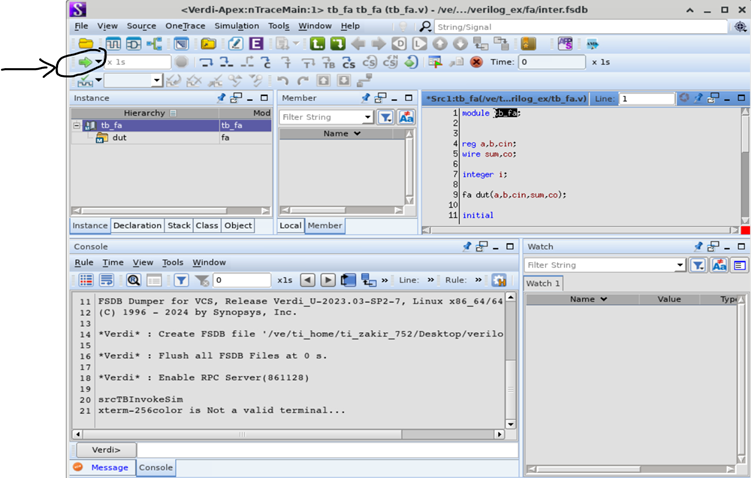
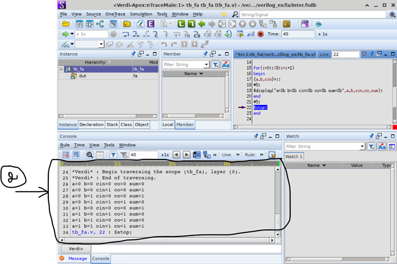
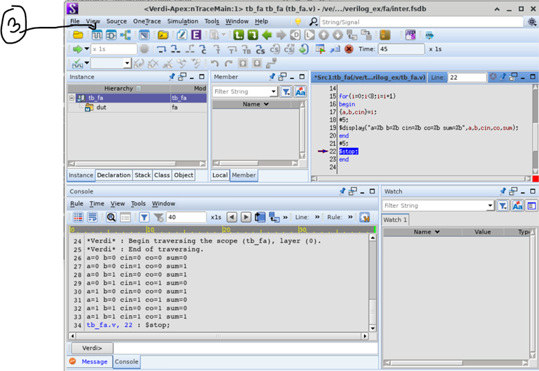
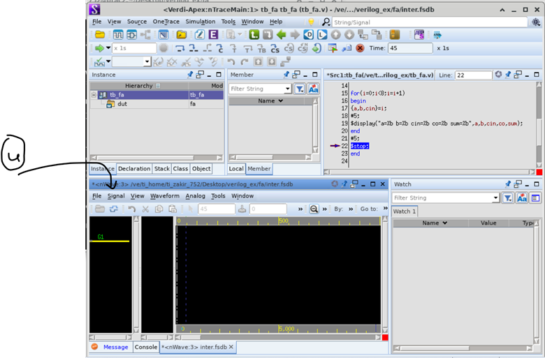
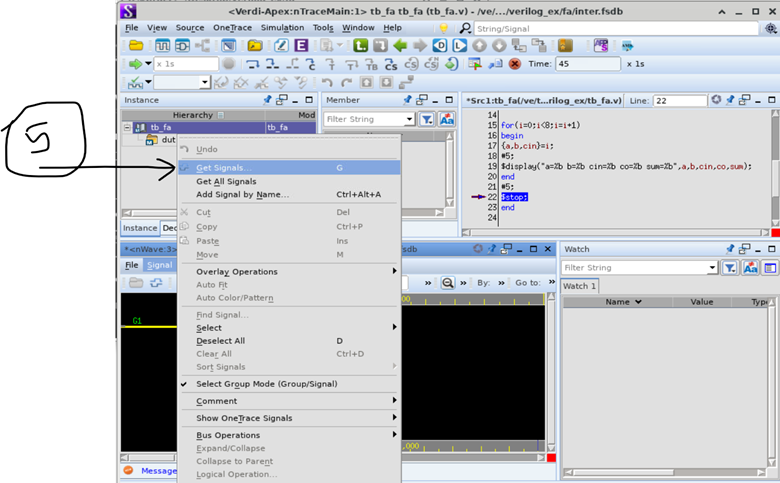
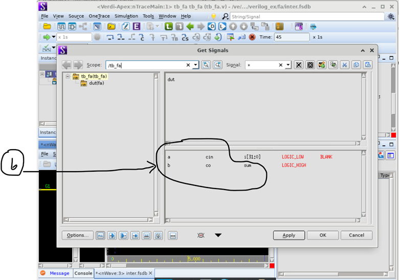
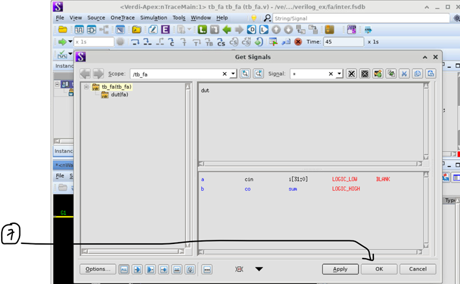
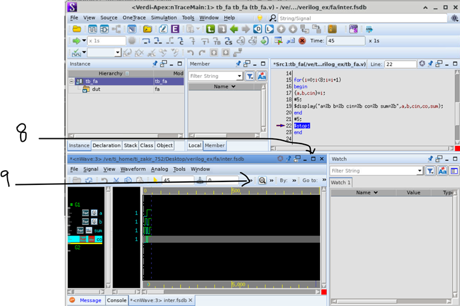

### This file contains the synopsys tools usgae info.
```
VCS (Verilog Compiler Simulator) – A high-performance simulator from Synopsys for functional verification of
                                    digital designs using Verilog/SystemVerilog.


Verdi – A powerful debug and visualization tool for analyzing simulation results and understanding complex SoC behavior.


SpyGlass – A static linting and RTL analysis tool that checks coding style, synthesis readiness,
            and potential bugs early in the design flow.

Steps to compile and run the Verilog code

step1: The following command is to compile the Verilog code:

vcs fa.v rca.v tb_rca.v -full64 -kdb -lca -debug_access+all

step1: The following command is to compile the SystemVerilog code:

vcs -sverilog fa.v rca.v tb_rca.v -full64 -kdb -lca -debug_access+all

[with different switch order]
//if systemverilog files

vcs -sverilog f1.sv  -full64 -kdb -lca -debug_access+all
vcs -sverilog f1.sv  -lca -kdb -debug_access+all -full64


step2: After compilation, the tool will produce a "simv" executable file. In the terminal type

./simv -verdi

it will open GUI 
```



*Fig.1*



*Fig.2*



*Fig.3*



*Fig.4*



*Fig.5*



*Fig.6*



*Fig.7*



*Fig.8*

### coverage 
```
step1: The following command is to compile the Verilog code:

vcs fa.v rca.v tb_rca.v -full64 -kdb -lca -debug_access+all

step1: The following command is to compile the SystemVerilog code:

vcs -sverilog fa.v rca.v tb_rca.v -full64 -kdb -lca -debug_access+all

step2: ./simv

step3:
verdi -cov -covdir simv.vdb
```


*Fig.1*


